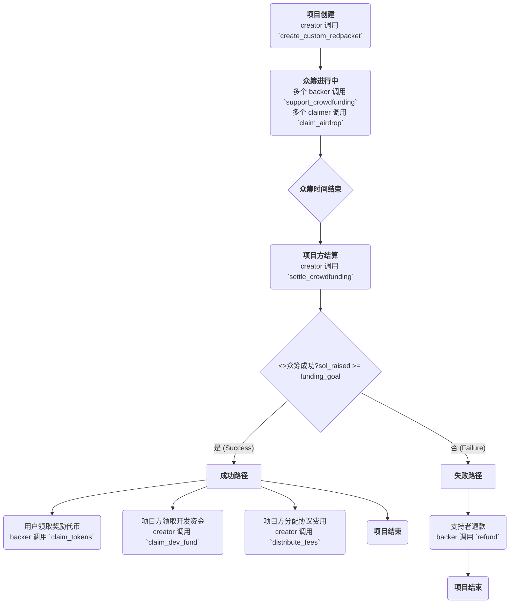

# 众筹红包 (Crowdfunding Redpacket)

[](https://github.com/) [](https://opensource.org/licenses/MIT)

一个部署在 Solana 区块链上的去中心化项目启动平台，融合了**众筹（Launchpad）、空投（Airdrop）、代币线性解锁（Vesting）** 以及**自动化流动性池创建**等多种功能。

---

## 目录

- [众筹红包 (Crowdfunding Redpacket)](#众筹红包-crowdfunding-redpacket)
  - [目录](#目录)
  - [项目概述](#项目概述)
  - [核心特性](#核心特性)
  - [系统架构与流程](#系统架构与流程)
  - [本地开发与测试](#本地开发与测试)
    - [先决条件](#先决条件)
    - [开发流程](#开发流程)
  - [合约指令接口 (API)](#合约指令接口-api)
  - [主要链上状态](#主要链上状态)
  - [未来工作](#未来工作)
  - [贡献](#贡献)
  - [许可证](#许可证)

## 项目概述

**众筹红包（Crowdfunding Redpacket）** 旨在为新的 Web3 项目提供一站式的代币发行和初始资金募集解决方案。项目方可以通过本协议，轻松地配置和发起一个包含多种代币分配策略的活动，并在众筹成功后，自动将一部分资金和代币注入 DEX（如 Raydium）创建初始流动性，从而实现无缝的“启动即交易”。

## 核心特性

- **高度可定制化**：支持项目方完全自定义代币的分配方案（空投、众筹奖励、流动性、团队等）和对应的解锁周期。
- **默认模板**：为简化操作，提供了经过验证的默认分配模板，一键启动标准活动。
- **线性解锁 (Vesting)**：为众筹参与者、开发团队等角色内置了线性解锁机制，防止早期抛压，保障项目长期健康。
- **分层支持机制**：支持设置不同等级的众筹参与额度，并匹配不同的代币解锁方案。
- **自动化流动性**：(待集成) 众筹成功后，可自动使用部分募集资金和项目代币，在主流 DEX 上创建流动性池。
- **安全透明**：所有资金由程序控制的 PDA 账户托管，所有操作和状态均在链上可查，确保了资金安全和流程透明。

## 系统架构与流程

本项目遵循经典的客户端-链上合约架构。用户通过前端 dApp 与部署在 Solana 上的合约程序进行交互。下图展示了项目的核心生命周期：



## 本地开发与测试

### 先决条件

- [Rust](https://www.rust-lang.org/tools/install)
- [Solana Tool Suite](https://docs.solana.com/cli/install-solana-cli-tools)
- [Anchor Framework](https://www.anchor-lang.com/docs/installation) (v0.29.0 或更高版本)
- [Node.js](https://nodejs.org/en/) & [Yarn](https://yarnpkg.com/getting-started/install)

### 开发流程

1. **克隆仓库**

    ```bash
    git clone [your-repo-url]
    cd crowdfunding_redpacket
    ```

2. **安装依赖**

    ```bash
    yarn install
    ```

3. **构建合约**

    ```bash
    anchor build
    ```

4. **运行测试**
    首先，在一个终端中启动本地验证器：

    ```bash
    anchor localnet
    ```

    然后，在另一个终端中运行测试脚本：

    ```bash
    anchor test
    ```

5. **部署到 Devnet**

    ```bash
    anchor deploy --provider devnet
    ```

## 合约指令接口 (API)

| 指令名称 | 描述 | 主要签名者 |
| :--- | :--- | :--- |
| `create_custom_redpacket` | 创建并初始化一个新的众筹红包项目。 | `creator` |
| `support_crowdfunding` | 允许用户使用 SOL 支持一个正在进行的众筹项目。 | `backer` |
| `claim_airdrop` | 允许用户领取空投。 | `claimer` |
| `settle_crowdfunding` | 由项目方在众筹结束后触发，进行活动结算。 | `creator` |
| `claim_tokens` | 众筹成功后，允许支持者领取他们应得的项目代币。 | `backer` |
| `refund` | 众筹失败后，允许支持者取回他们投入的 SOL。 | `backer` |
| `claim_dev_fund` | 众筹成功后，允许项目方领取分配给开发团队的 SOL。| `creator` |
| `distribute_fees` | 众筹成功后，允许项目方触发协议费用的分配。 | `creator` |

## 主要链上状态

- `RedPacket`: 存储一个活动的所有核心数据。
- `SolVault`: PDA 金库，托管所有众筹募集的 SOL。
- `TokenVault`: PDA 金库，托管所有用于分配的项目代币。
- `BackerState`: PDA，记录每个支持者的个人参与状态。
- `AirdropState`: PDA，记录每个地址的空投领取状态。

## 未来工作

- [ ] **完成 Raydium 集成**：实现 `settle_crowdfunding` 中自动创建和注入流动性池的逻辑。
- [ ] **增加可配置项**：将 `developer_wallet` 地址、协议费用百分比等硬编码的常量，改为从一个可升级的配置账户中读取。
- [ ] **更复杂的解锁模型**：支持如“悬崖期+线性解锁”（Cliff + Linear Vesting）等更复杂的模型。
- [ ] **治理功能**：引入治理代币和投票机制，用于决定平台参数等。

## 贡献

欢迎任何形式的贡献！如果您发现 Bug 或有功能建议，请随时提交 Issues 或 Pull Requests。

## 许可证

本项目采用 [MIT](https://opensource.org/licenses/MIT) 许可证。
