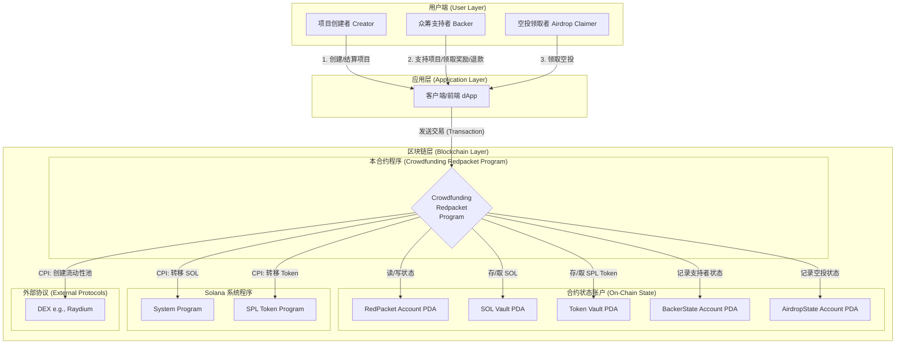

当然可以。一个清晰的架构图和一份完整的文档是任何高质量项目的核心组成部分。这能帮助您（以及未来的合作者）更好地理解项目的设计、逻辑和交互方式。

下面，我将为您提供这个**众筹红包（Crowdfunding Redpacket）项目**的系统架构图和一份详尽的设计文档。

-----

### 一、 系统架构图

我将使用 `Mermaid` 语法来绘制架构图。您可以将这段代码复制到任何支持 Mermaid 的 Markdown 编辑器（如 Typora、VS Code 预览、GitHub）中，它会自动渲染成一张清晰的图表。

#### 架构图解读

1. **用户层 (User Layer)**：代表了与系统交互的三种主要角色。
2. **应用层 (Application Layer)**：通常是一个网站或 dApp，作为用户与区块链交互的图形化界面。
3. **区块链层 (Blockchain Layer)**：
      * **本合约程序**：您编写的核心智能合约，包含了所有的业务逻辑。
      * **合约状态账户**：由您的合约创建和管理的链上账户，用于存储所有数据。它们都是 PDA（程序派生地址），确保只有您的合约能控制它们。
          * `RedPacket Account`: 每个众筹项目的核心数据。
          * `SOL Vault`: 专门用于托管众筹募集到的 SOL。
          * `Token Vault`: 专门用于托管项目方发行的代币。
          * `BackerState` & `AirdropState`: 记录每个用户与特定项目交互的状态（是否支持、是否已领取等）。
      * **Solana 系统程序**：Solana 官方提供的基础程序，您的合约通过 CPI（跨程序调用）来使用它们的核心功能，如 SOL 转账、创建账户等。
      * **外部协议**：您的合约可以与其他 DeFi 协议交互，最典型的就是在结算时调用 Raydium 的程序去创建流动性池。

-----

### 二、 项目设计与技术文档

#### 1\. 项目概述

**众筹红包（Crowdfunding Redpacket）** 是一个部署在 Solana 区块链上的去中心化应用协议。它旨在为新的代币项目提供一个集成的启动平台，融合了**众筹（Launchpad）、空投（Airdrop）、代币线性解锁（Vesting）** 以及**自动化流动性池创建**等多种功能。项目方可以通过一个简单的指令来配置和启动一个完整的代币发行和募资活动。

#### 2\. 核心概念

* **红包 (RedPacket)**：代表一个完整的众筹和空投活动实例。每个项目方创建一个 `RedPacket` 账户来定义其活动的所有参数。
* **分配方案 (Allocations)**：项目方在创建红包时，需定义其发行的代币如何分配，例如：`40%` 用于众筹奖励，`30%` 用于创建流动性，`20%` 给开发团队，`10%` 用于空投。这是项目的核心代币经济学。
* **线性解锁 (Linear Vesting)**：为了防止代币在上线初期被大量抛售，可以为不同分配池（如开发团队、众筹参与者）设置解锁周期（`unlock_months`）。代币将按月线性释放。
* **金库 (Vaults)**：合约使用两个独立的 PDA 金库来安全地托管资产：一个 `sol_vault` 用于存放用户支持的 SOL，一个 `token_vault` 用于存放项目方发行的代币。

#### 3\. 链上程序 (Smart Contract)

##### 3.1. 主要状态结构 (State Structs)

* **`RedPacket`**: 存储一个众筹活动的所有核心数据，包括创建者、代币信息、众筹目标、结束时间、所有分配方案、当前状态（是否结算、是否成功）以及所有结算后的资金分配结果。
* **`AllocationEntry`**: 一个辅助结构，用于定义 `RedPacket` 中每一项代币分配的名称、数量和解锁周期。
* **`BackerState`**: 记录每一位支持者与特定红包的交互状态，包括其支持的 SOL 金额、已领取的代币数量、以及是否已退款。
* **`AirdropState`**: 记录每一位用户是否已经领取过特定红包的空投。

##### 3.2. 主要指令 (Instructions)

| 指令名称 | 功能描述 | 签名者 | 核心操作 |
| :--- | :--- | :--- | :--- |
| `create_custom_redpacket` | 创建并初始化一个新的众筹红包项目。 | `creator` | 1. 验证所有输入参数的合法性。\<br\>2. 初始化 `RedPacket`、`sol_vault`、`token_vault` 账户。\<br\>3. 将项目方发行的代币从其个人账户转入 `token_vault`。|
| `support_crowdfunding` | 允许用户使用 SOL 支持一个正在进行的众筹项目。 | `backer` | 1. 验证项目是否在进行中。\<br\>2. 验证支持金额是否符合规则。\<br\>3. 将用户的 SOL 转入 `sol_vault`。\<br\>4. 初始化或更新用户的 `BackerState`。|
| `claim_airdrop` | 允许用户领取空投。 | `claimer` | 1. 验证空投是否还有名额。\<br\>2. 验证用户是否首次领取。\<br\>3. 从 `token_vault` 中将空投代币转给用户。\<br\>4. 更新 `AirdropState` 和 `RedPacket` 的空投计数。|
| `settle_crowdfunding` | 由项目方在众筹结束后触发，进行活动结算。 | `creator` | 1. 验证活动是否已到期且未结算。\<br\>2. 判断众筹是否成功（`sol_raised >= funding_goal`）。\<br\>3. **如果成功**：计算募集到的 SOL 的分配方案，并创建流动性池（待集成）。\<br\>4. **如果失败**：仅更新状态，允许用户退款。|
| `claim_tokens` | 众筹成功后，允许支持者领取他们应得的项目代币。 | `backer` | 1. 验证项目是否成功结算。\<br\>2. 根据线性解锁规则，计算用户当前可领取的代币数量。\<br\>3. 从 `token_vault` 将代币转给用户。\<br\>4. 更新用户的 `BackerState` 中的 `claimed_amount`。|
| `refund` | 众筹失败后，允许支持者取回他们投入的 SOL。 | `backer` | 1. 验证项目是否失败结算。\<br\>2. 验证用户是否尚未退款。\<br\>3. 从 `sol_vault` 将用户当初支持的 SOL 全额退还。\<br\>4. 更新用户的 `BackerState`。|
| `claim_dev_fund` | 众筹成功后，允许项目方按月领取分配给开发团队的 SOL。| `creator` | 1. 验证项目是否成功结算。\<br\>2. 根据线性解锁规则，计算当前可领取的 SOL 数量。\<br\>3. 从 `sol_vault` 将 SOL 转给项目方。\<br\>4. 更新 `RedPacket` 中的 `dev_fund_claimed`。|
| `distribute_fees` | 众筹成功后，允许项目方触发协议费用的分配。 | `creator` | 1. 验证费用是否尚未分配。\<br\>2. 从 `sol_vault` 将协议费转给指定的开发者/平台钱包。|

#### 4\. 典型用户流程

##### 4.1 成功流程

1. **创建**: `creator` 调用 `create_custom_redpacket` 发起项目。
2. **支持**: 多个 `backer` 在项目到期前调用 `support_crowdfunding`，使得 `sol_raised` 达到或超过 `funding_goal`。
3. **结算**: `creator` 在到期后调用 `settle_crowdfunding`，项目被标记为 `success: true`。
4. **领取**:
      * `backer` 们根据解锁进度，分多次或一次性调用 `claim_tokens` 领取他们的代币奖励。
      * `creator` 根据解锁进度，分多次调用 `claim_dev_fund` 领取开发资金 SOL。
      * `creator` 调用 `distribute_fees` 将协议费打给平台。

##### 4.2 失败流程

1. **创建**: `creator` 调用 `create_custom_redpacket`。
2. **支持**: 到项目结束时，`sol_raised` 未达到 `funding_goal`。
3. **结算**: `creator` 调用 `settle_crowdfunding`，项目被标记为 `success: false`。
4. **退款**: 所有 `backer` 调用 `refund`，100% 取回他们当初投入的 SOL。

#### 5\. 安全性考虑

* **所有权与权限控制**：所有敏感操作（如 `create`, `settle`）都要求 `creator` 作为 `Signer`，确保只有项目方能执行。
* **程序派生地址 (PDA)**：所有托管资金的账户（Vaults）和状态账户都是 PDA，确保了它们的所有权归属于本合约程序，用户无法直接操作。
* **防重入/重复操作**：通过 `settled`, `refunded`, `fees_distributed` 等布尔标志位，有效防止了重复结算、重复退款等恶意操作。
* **安全数学运算**：合约中所有关键的算术运算都使用了 `checked_*` 方法，从根本上杜绝了算术溢出风险。
* **全面的输入验证**：对所有用户输入（如参数、账户）都进行了严格的校验。

-----

这份文档为您项目的当前状态提供了一个完整和清晰的快照。希望它能对您有所帮助！
