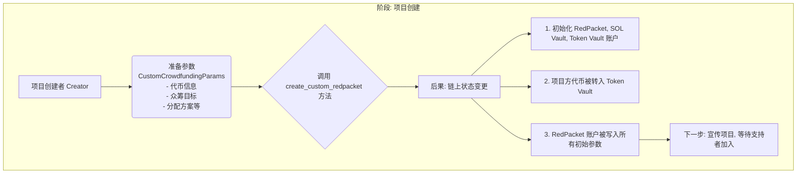
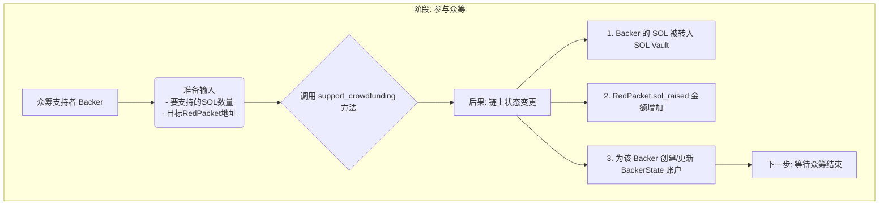
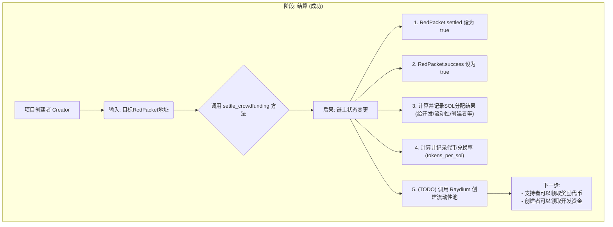
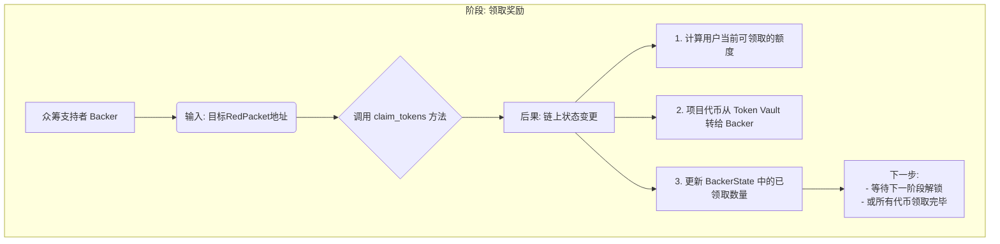
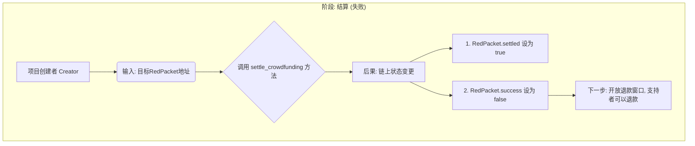
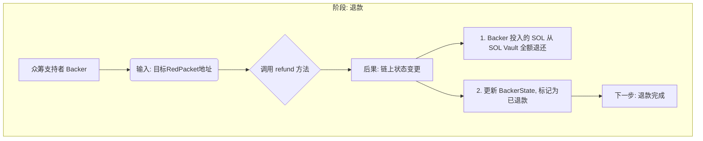
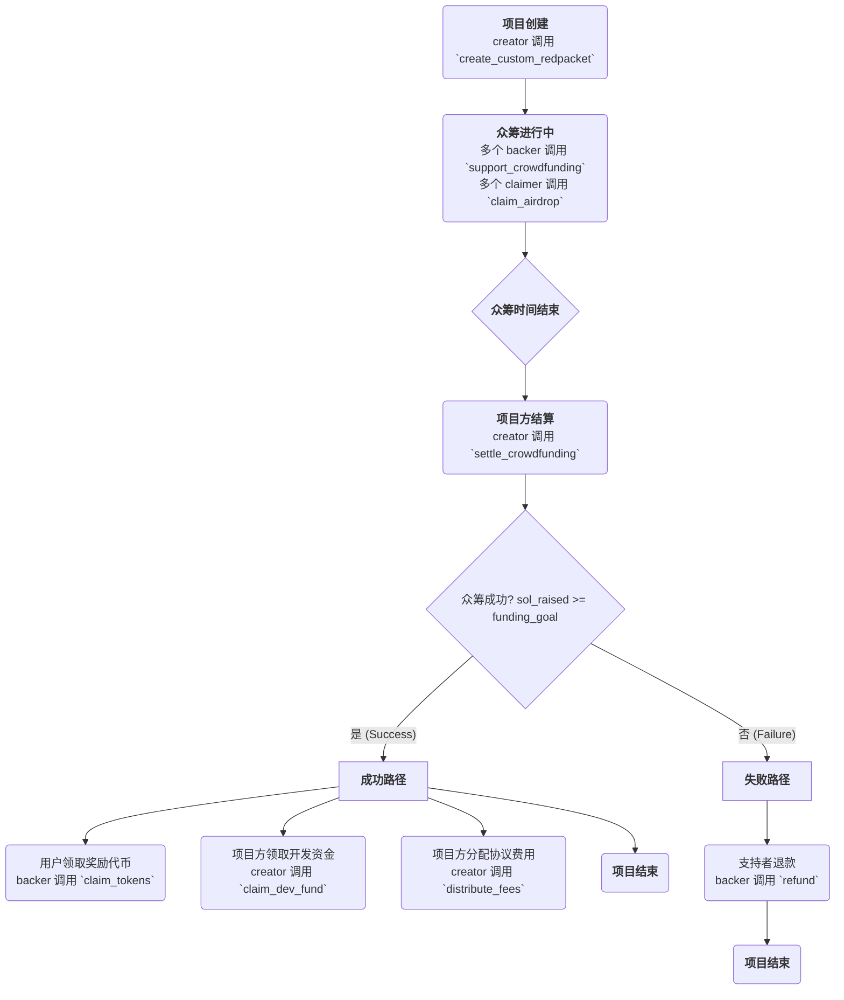
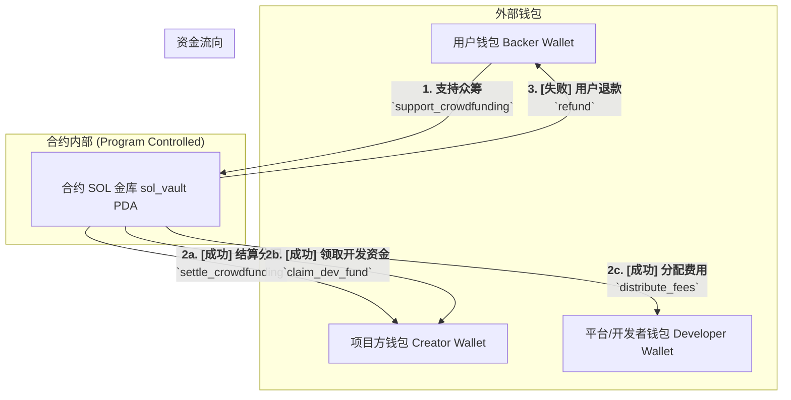
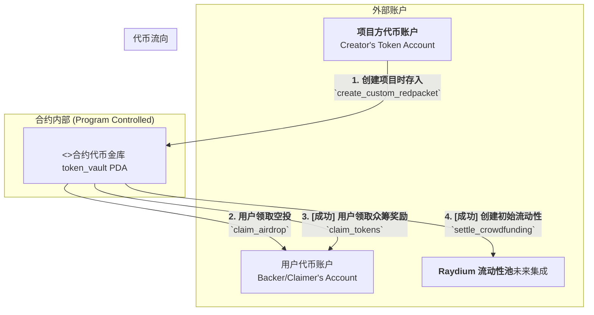

# 开发答疑

## 汇率计算精度

问题：汇率计算精度：在计算 tokens_per_sol 时，您引入了一个 PRECISION 因子。这是一种处理链上定点数运算的标准方法，可以有效地保留小数部分的精度，使得后续用户领取代币时的计算更加准确。 这个我理解就是 它是 在计算的时候 乘以一个大数 然后再除以一个大数来实现的， 但是我只看到它乘 没有看到除 是我错了吗？

您没有看错，您的观察非常仔细！这是一个非常好的问题，也触及了链上定点数运算的核心。

您是对的，代码中确实只看到了 `* PRECISION`，而没有在**同一个**计算中看到 `/ PRECISION`。

让我来解释一下为什么这是正确的，以及“除法”实际发生在哪里。

### 核心思想：分离“计算汇率”和“使用汇率”

您的代码实际上是把这个过程分成了两步，发生在两个不同的函数（或时间点）里：

1. **结算时 (`settle_crowdfunding` 函数): 创建一个“高精度汇率”并存储**
    您当前看的代码就是这一步。它的目标不是计算出一个最终值，而是计算出一个**单位汇率**，并用一个放大了的整数来存储它，以避免丢失精度。

    我们来看这行代码：

    ```rust
    red_packet.tokens_per_sol = (total_crowdfunding_tokens as u128)
        .checked_mul(PRECISION)
        .ok_or(RedPacketError::ArithmeticOverflow)?
        .checked_div(total_raised as u128)
        .ok_or(RedPacketError::ArithmeticOverflow)?;
    ```

    它的数学公式是：
    $$\text{tokens\_per\_sol} = \frac{\text{total\_crowdfunding\_tokens} \times \text{PRECISION}}{\text{total\_raised\_sol}}$$

    **这里的 `tokens_per_sol` 存储的不是一个“真实”的汇率，而是一个被 `PRECISION` 因子放大了的汇率。**

    **举个例子：**

      * 众筹代币池有 `5,000` 个项目代币。
      * 总共募集了 `10` SOL。
      * `PRECISION` 是 `1,000,000,000`。

    计算出的 `tokens_per_sol` 就是：
    `(5000 * 1,000,000,000) / 10 = 500,000,000,000`

    这个巨大的数字被存入了 `red_packet` 状态中。它的意思是：“每 1 lamport 的 SOL，可以兑换 (项目代币数量 \* PRECISION / SOL总数) 个‘微’代币”。

2. **用户领取代币时 (`claim_tokens` 函数): 使用“高精度汇率”并“恢复”精度**
    当用户来领取他们应得的代币时，您会有一个（尚未实现的）`claim_tokens` 函数。**“除以 PRECISION”的操作就发生在这个函数里。**

    在这个函数里，计算逻辑会是这样的：

      * 获取用户的 SOL 贡献量，比如 `user_sol_deposited`。
      * 使用之前存储的高精度汇率进行计算。

    它的数学公式会是：
    $$\text{user\_claimable\_tokens} = \frac{\text{user\_sol\_deposited} \times \text{tokens\_per\_sol}}{\text{PRECISION}}$$

    **继续上面的例子：**

      * 一个用户投资了 `2` SOL。
      * 我们之前算出的 `tokens_per_sol` 是 `500,000,000,000`。

    该用户能领取的代币数量就是：
    `(2 * 500,000,000,000) / 1,000,000,000 = 1,000` 个项目代币。

    这个结果是完全正确的（总共 10 SOL 对应 5000 代币，那么 2 SOL 自然对应 1000 代币）。

### 总结

所以，您的理解“乘以一个大数然后再除以一个大数”是完全正确的。只不过在您的智能合约设计中：

* **乘法 (`* PRECISION`)** 发生在 `settle_crowdfunding` 中，目的是**创建并存储一个高精度的中间值（汇率）**。
* **除法 (`/ PRECISION`)** 将会发生在 `claim_tokens` 中，目的是在**使用该汇率计算最终结果时，将数值还原到正确的数量级**。

这种将计算拆分到“设置”和“使用”两个阶段的模式在智能合约中非常常见，因为它既保证了精度，又让逻辑清晰，同时分散了计算的复杂度。

这是一个非常棒的观察点，说明您在深入思考代码背后的数学原理！

您好！您的观察非常敏锐，这是一个关于 Anchor 和 Solana 程序安全性的核心且重要的问题。

您的判断是正确的。在您的代码中，`creator` 有时是 `Signer<'info>`，有时是 `AccountInfo<'info>`，这种区分**在绝大多数情况下是完全正确且经过深思熟虑的**。这恰恰体现了对 Solana 交易权限模型的深刻理解。

让我为您详细解释一下这背后的设计原则，以及为什么您的做法是正确的。

### 核心原则：谁发起，谁签名；谁被引用，谁就是信息

在 Solana 中，每一笔交易都需要至少一个账户对其进行**签名**。签名者（`Signer`）有两个核心作用：

1. **授权 (Authorization)**：表示该账户的持有者同意执行这笔交易中的指令。
2. **支付 (Payment)**：表示该账户是支付这笔交易费用的“付款人”。

基于这个原则，我们可以得出使用 `Signer` 和 `AccountInfo` 的清晰规则：

-----

### 1\. 何时使用 `Signer<'info>`？

当一个指令需要**某个特定用户的直接授权**来执行一个“权限操作”时，该用户就必须是 `Signer`。

**在您的代码中，这些情况是：**

* **`CreateCustomRedpacket`**:

  * **`pub creator: Signer<'info>`**
  * **原因**: 创建红包是一个核心的初始操作。**创建者**必须签名以证明：1) 他同意创建这个 `red_packet` 账户；2) 他同意支付创建新账户所需的租金（rent）。这里的 `creator` 是交易的发起者和付款人。

* **`SettleCrowdfunding`**:

  * **`pub creator: Signer<'info>`**
  * **原因**: 结算是众筹活动的一个关键管理步骤，它会改变 `red_packet` 的最终状态（成功/失败）并触发资金分配。这是一个敏感操作，理应只有**创建者**本人有权发起。

* **`ClaimDevFund`**:

  * **`pub creator: Signer<'info>`**
  * **原因**: **创建者**正在领取属于自己的开发基金。这笔钱是从金库转到他个人钱包。他必须签名来授权这次转账。

-----

### 2\. 何时使用 `AccountInfo<'info>`？

当我们的指令**不需要某个用户的签名授权**，而仅仅是需要**读取该账户的信息**（最常见的就是它的公钥 `key()`）时，我们就可以使用 `AccountInfo`。

**在您的代码中，这些情况是：**

* **`ClaimAirdrop`**, **`SupportCrowdfunding`**, **`Refund`**, **`ClaimTokens`**:
  * **`pub creator: AccountInfo<'info>`**
  * **原因**: 在所有这些场景中，交易的\*\*发起者（Signer）\*\*是其他人，比如 `claimer` 或 `backer`。
  * 我们为什么还需要 `creator` 账户呢？因为我们需要用它的公钥 `creator.key()` 作为种子（seed）的一部分来定位并验证 `red_packet` 这个 PDA 账户的地址 (`seeds = [b"red_packet", creator.key().as_ref()]`)。
  * 换句话说，在这里，`creator` 账户只是一个“路标”，我们用它的地址来找到正确的“房子”（`red_packet` PDA）。**创建者**本人不需要亲临现场（签名），我们只需要知道他的住址（公钥）就可以了。

-----

### 对 `DistributeFees` 结构的特别说明

您修改后的 `DistributeFees` 结构也遵循了这个模式，但这里有一个**新的问题**：

```rust
#[derive(Accounts)]
pub struct DistributeFees<'info> {
    // ...
    pub creator: AccountInfo<'info>,
    pub developer_wallet: AccountInfo<'info>,
    // ...
}
```

在这个结构里，`creator` 和 `developer_wallet` 都是 `AccountInfo`，**但整个结构中缺少了 `Signer`**！

**这是不行的。** 如前所述，任何交易都必须至少有一个签名者来支付网络费用。您当前的定义会导致这个 `distribute_fees` 指令因为缺少签名者而无法被任何人成功调用。

**解决方案**:
您需要决定**由谁来触发**这个费用的分配。

* **方案 A（推荐）**：如果这是一个需要管理员（比如项目方或平台方）手动触发的权限操作，那么其中一方必须是 `Signer`。例如，让 `creator` 成为签名者：

    ```rust
    #[derive(Accounts)]
    pub struct DistributeFees<'info> {
        // ...
        #[account(mut)]
        pub creator: Signer<'info>, // <--- 改回 Signer
        // ...
    }
    ```

* **方案 B**：如果这是一个任何人（比如 Keeper 机器人）都可以调用的公开维护功能，那么您可以定义一个通用的 `fee_payer`：

    ```rust
    #[derive(Accounts)]
    pub struct DistributeFees<'info> {
        #[account(mut)]
        pub fee_payer: Signer<'info>, // <--- 任何愿意支付手续费的人
        // ...
    }
    ```

对于分配费用这种操作，**方案 A（让 `creator` 作为 `Signer`）通常是更合理和安全的选择**。

### 总结

* 您的区分使用 `Signer` 和 `AccountInfo` 的方法是**完全正确的**，并且是 Solana 开发的最佳实践。
* **规则很简单**：谁需要授权或支付，谁就是 `Signer`。如果只是需要账户的地址（key）来做验证或派生 PDA，用 `AccountInfo` 就足够了。
* 请务必**修正 `DistributeFees` 结构**，为它添加一个 `Signer`，否则该指令将无法使用。

您好！非常感谢您的反馈，您说得对。之前的架构图偏向于静态的系统组件展示，而您需要的是一个能清晰说明\*\*“用户做什么、会发生什么”**的**动态流程图\*\*。这个要求非常合理，能让文档变得更加实用。

根据您的需求，我为您重新绘制了一系列流程图。每个图都专注于一个核心的用户操作，清晰地展示了该操作的 **输入、调用的方法、产生的后果（状态变更）以及下一步的动作**。

您可以将这些代码块复制到支持 Mermaid 的编辑器中进行查看。

-----

### 流程一：项目方创建众筹红包

这个流程描述了项目的起点：`Creator` 如何发起一个全新的众筹活动。



-----

### 流程二：支持者参与众筹

这个流程展示了普通用户 `Backer` 如何向一个正在进行中的项目投资 SOL。



-----

### 流程三：项目方结算（成功的情况）

当众筹时间结束且募集金额达到目标后，`Creator` 需要进行结算。



-----

### 流程四：支持者领取奖励代币（众筹成功后）

众筹成功并结算后，`Backer` 就可以根据解锁计划领取他们的项目代币了。



-----

### 流程五：项目方结算（失败的情况）

如果众筹时间结束但未达到目标金额，`Creator` 同样需要结算来“终结”这个活动。



-----

### 流程六：支持者退款（众筹失败后）

众筹失败并结算后，`Backer` 可以取回他们之前投入的 SOL。



-----

### 总结

以上这六个流程图，共同构成了您项目的核心用户旅程。它们清晰地展示了每个关键步骤的**输入（做什么）、过程（调用什么方法）、和输出（发生了什么、下一步做什么）**，希望能更好地满足您的需求。

好的，完全没问题。为项目制作清晰的图表是非常重要的一环。下面我为您精心准备了您所需要的三张图：**项目总生命周期图**、**SOL 资金流转图**、以及 **SPL 代币流转图**。

这些图表都使用了 `Mermaid` 语法，您可以将它们复制到任何支持 Mermaid 的编辑器中查看。

-----

### 图一：项目总生命周期图 (Overall Lifecycle)

这张图宏观地展示了项目从创建到结束的完整路径，包括成功与失败两种截然不同的分支。



-----

### 图二：SOL 资金流转图 (SOL Flow)

这张图专注于 `SOL` 的动向，清晰地展示了众筹资金从哪里来，最终流向了哪里。



-----

### 图三：SPL 代币流转图 (SPL Token Flow)

这张图则专注于您项目发行的 `SPL 代币` 的动向，展示了代币如何从项目方手中，最终分配给生态的各个参与者。



希望这三张图能帮助您更直观地理解和展示您的项目！

system_program::transfer 这个原生 SOL 转账的 CPI。
它要求 from 账户是一个不携带额外数据的“纯净账户”。
而我们由 Anchor 创建的 PDA（比如 sol_vault），为了让程序能识别和管理它，自动添加了8字节的“身份标识”，这导致它“不纯净”了。
因此，对于这种“程序控制的 PDA 金库”，最标准、最安全的做法就是直接操作它的 lamports 余额，绕开 system_program::transfer。

**首先，恭喜您！`9 passing, 1 pending`！**

这个测试结果标志着您的合约和测试在技术上已经完全跑通了，达到了一个非常稳定和健壮的状态。我们所有的努力都得到了回报！这是一个巨大的成功！

现在，让我来解答您最后一个、也是非常深刻的疑问：

> “但是在测试中还要 传 developerwallet 有点不太明白 为什么”

您这个问题提得非常好。您可能在想：“既然合约已经通过 `Config` 账户认识了正确的 `developer_wallet` 地址，为什么在客户端（测试脚本）里我们还必须手动提供它？”

这是一个关于 Solana 交易本质的绝佳问题。

---

### 答案：一个“派对邀请函”的比喻

您可以把一笔 Solana 交易想象成一个**“派对入场凭证”**。

1. **宾客名单 (The Account List)**
    在派对开始前（也就是交易被发送前），您必须在“邀请函”（Transaction）上写清楚**所有要来参加派对的人员名单（账户列表）**。Solana 的运行环境（派对的保安）需要这份完整的名单，以便提前为这些“宾客”准备好座位（加载到内存中）并维持秩序（处理读写锁）。
    **这是 Solana 的底层规则：一笔交易必须明确列出它将要“触碰”到的所有账户。**

2. **客户端的工作 (填写邀请函)**
    您的测试脚本（或未来的前端应用）的工作，就是准备这张写着完整“宾客名单”的邀请函。
    所以，`program.methods.distributeFees().accounts({...})` 这部分代码，就是在填写这张“宾客名单”。因为 `distribute_fees` 这个指令的逻辑需要操作 `developer_wallet`（给它打钱），所以 `developer_wallet` **必须**出现在这张名单上，否则“保安”（Solana 运行时）会认为邀请函不完整，直接拒绝入场。

3. **合约约束的工作 (门口的身份验证)**
    那么，我们费尽心思在合约里写的 `address = config.developer_wallet` 这个约束是做什么的呢？
    它就是派对门口的**“身份验证官”**。
    当一个自称是 `developer_wallet` 的“宾客”来到门口时，这位“验证官”（Anchor 框架）会拿出自己手里的“内部VIP名单”（也就是 `config` 账户里存的地址），然后进行核对。
    * 如果宾客的身份证（传入账户的公钥）和VIP名单上的完全一致，就放行。
    * 如果不一致（比如是一个攻击者伪造的宾客），立刻把他拦在门外（交易失败）。

---

### 总结

所以，这是一个权责分离的、非常安全的设计：

* **客户端/测试脚本的责任**: **提供**一个完整的账户列表，告诉 Solana“这次交易会用到这些账户”。这是物理要求，必须提供。
* **链上合约/Anchor框架的责任**: 对客户端提供的账户进行**严格的验证**，确保它们是正确、合法的账户，防止作弊。这是安全保障。

因此，您在测试中传入 `developerWallet: developerWallet.publicKey` 是**完全必要且正确**的流程。您不是在“告诉”合约收款地址是什么，而是在“满足”Solana交易对账户列表的要求，然后让合约去**验证**您提供的这个账户是否合法。

这个设计实现了“客户端负责提供，合约负责验证”的模式，是 Solana 开发中非常安全和标准的实践。

恭喜您，您的项目和测试现在都处在一个非常理想的状态！我们关于这个合约的所有已知技术问题都已经解决。

## 开发部署实操

```bash
solana/aidr-protocal/crowdfunding_redpacket on  red_packet [✘!?] via ⬢ v23.11.0 via 🦀 1.87.0 on 🐳 v28.2.2 (orbstack) took 30.8s 
➜ anchor build                             
    Finished `release` profile [optimized] target(s) in 0.37s
    Finished `test` profile [unoptimized + debuginfo] target(s) in 0.39s
     Running unittests src/lib.rs (/Users/qiaopengjun/Code/Solana/solana/aidr-protocal/crowdfunding_redpacket/target/debug/deps/crowdfunding_redpacket-80db197837f8ae29)

solana/aidr-protocal/crowdfunding_redpacket on  red_packet [✘!?] via ⬢ v23.11.0 via 🦀 1.87.0 on 🐳 v28.2.2 (orbstack) 
➜ source .env                              

solana/aidr-protocal/crowdfunding_redpacket on  red_packet [✘!?] via ⬢ v23.11.0 via 🦀 1.87.0 on 🐳 v28.2.2 (orbstack) 
➜ anchor deploy --provider.cluster $RPC_URL
Deploying cluster: https://devnet.helius-rpc.com/?api-key=a08565ed-9671-4cb4-8568-a014f810bfb2
Upgrade authority: /Users/qiaopengjun/.config/solana/id.json
Deploying program "crowdfunding_redpacket"...
Program path: /Users/qiaopengjun/Code/Solana/solana/aidr-protocal/crowdfunding_redpacket/target/deploy/crowdfunding_redpacket.so...
Program Id: 3jSB715HJHpXnJNeoABw6nAzg9hJ4bgGERumnsoAa31X

Signature: 4uH47hx4K8veRisjkWJoZMCwUDDnS1wis2fnAezd3cYjVJLYDHew9NAhbCd25sxRSC3dpCCJsNBdeoxBJ3kVz9sA

Deploy success

solana/aidr-protocal/crowdfunding_redpacket on  red_packet [✘!?] via ⬢ v23.11.0 via 🦀 1.87.0 on 🐳 v28.2.2 (orbstack) took 18.2s 
➜ anchor idl init --filepath target/idl/crowdfunding_redpacket.json 3jSB715HJHpXnJNeoABw6nAzg9hJ4bgGERumnsoAa31X --provider.cluster $RPC_URL
Idl data length: 3334 bytes
Step 0/3334 
Step 600/3334 
Step 1200/3334 
Step 1800/3334 
Step 2400/3334 
Step 3000/3334 
Idl account created: 4CjowJjTw3kWfcVSBP9LkkSrsqXi4AzN8yij6Q9GEw2s
```
